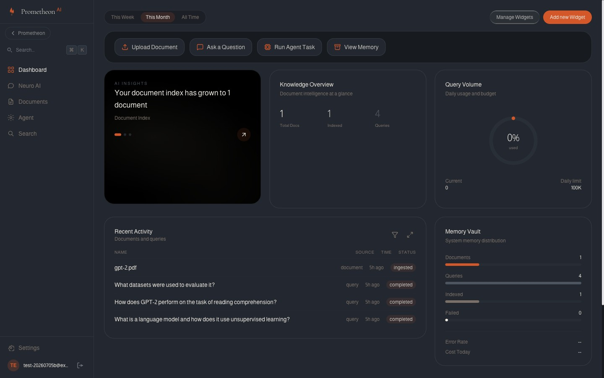
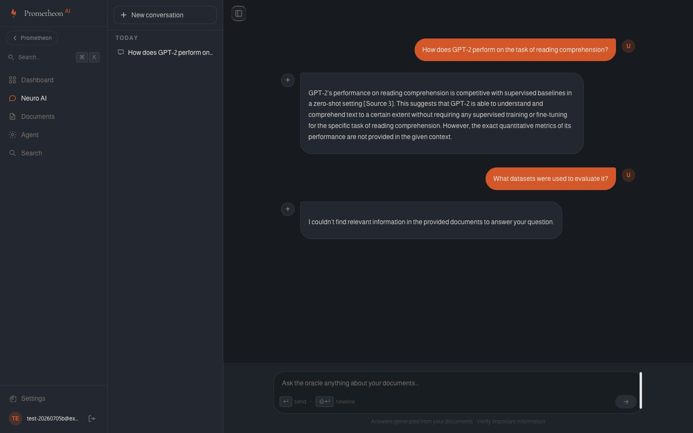

<div align="center">

# 🔥 PrometheonAI

**A production-style RAG + agent platform — upload your documents, get grounded, cited answers.**

[**Live Demo**](https://prometheon-five.vercel.app) · [Architecture](ai-backend/docs/architecture.md) · [Eval Methodology](ai-backend/docs/eval-results-phase4.md)

</div>

<br>


## What this is

PrometheonAI is a full-stack AI product: upload a PDF, and ask questions about it in plain language. Under the hood, every answer is retrieved from your actual document content and cited back to its source — the system is built to say "I don't know" rather than invent an answer when nothing relevant is found. A second mode, the reasoning agent, breaks multi-step questions into tool calls (searching documents, comparing sources, checking the live web) and shows its full reasoning trace, not just a final answer.

It's built the way a real product would be: JWT authentication, a tiered LLM routing system (so it can run entirely on free infrastructure), rate limiting and cost controls, structured observability, and an eval harness — not just a weekend RAG demo wired directly to an API key.

**For engineers:** a Python/FastAPI backend (RAG pipeline, ReAct agent with function-calling tools, guardrails, prompt versioning with output validation, short + long-term memory, LLM-as-judge evals) behind a Next.js 16 App Router frontend (Server Components, SSE token streaming, Drizzle/Postgres, a resilient HTTP service layer with retry/timeout/cancellation). See [Architecture](#architecture) below.

## Try it live

**[prometheon-five.vercel.app](https://prometheon-five.vercel.app)** — register with any email and you're on the free tier automatically (Groq + a local embedding model, zero cost to run).

Two things about the free demo, stated honestly upfront:
- **The document store is ephemeral.** The Python backend runs on a Hugging Face Space free-tier container; ChromaDB is not backed by a persistent volume there, so uploaded documents are wiped on redeploy or container restart. Upload a PDF, ask it questions, and it'll work — just don't expect it to survive across sessions on the free tier.
- **Cold starts.** The backend container can sleep after inactivity. An uptime monitor pings it every 5 minutes to keep it warm, but the very first request after a long idle period may take a few extra seconds.

## Screenshots

| | |
|---|---|
|  |  |
| Sign-in | Live dashboard — document/query stats, cache hit rate, retrieval quality |
|  | |
| Chat with source citations and a retrieval-confidence badge | |

## Features

- **RAG pipeline** — PDF ingestion (including OCR for embedded figures/tables via `unstructured`), semantic + multi-query retrieval, score-threshold filtering, token-aware context assembly, inline source citations
- **Honest no-results handling** — when retrieval finds nothing relevant, the system says so explicitly instead of letting the LLM improvise an answer with no grounding
- **ReAct agent with tools** — document search, document metadata, cross-document comparison, live web search (Tavily), and a sandboxed calculator; full step-by-step reasoning trace surfaced in the UI, not hidden
- **Tiered LLM routing** — the project owner's account runs on OpenAI GPT-4o; every other account runs on Groq's `llama-3.3-70b` + a local HuggingFace embedding model, entirely free to operate at scale
- **Guardrails** — input sanitization against common prompt-injection patterns, PII stripping on output, an off-topic check before the LLM is invoked at all
- **Memory** — short-term conversation windowing (token-aware) plus a long-term per-user fact store (embedded, deduplicated, user-viewable and user-deletable in Settings)
- **Auth** — real JWT sessions (short-lived access token + HttpOnly refresh cookie), bcrypt password hashing, timing-attack-resistant login
- **Observability** — structured JSON logging, distributed tracing, log-aggregated metrics feeding the live dashboard (query volume, latency, cache hit rate, cost)
- **Production hardening** — per-user rate limiting, a daily token budget, a concurrency-limited request queue, and graceful degradation in the UI when the backend is temporarily unreachable
- **Evals** — an LLM-as-judge harness (GPT-4o scoring faithfulness/relevance/completeness) over a 20-question dataset spanning factual, inferential, edge-case, and adversarial questions

## Architecture

```
Browser
  │  HTTPS
  ▼
Next.js 16 (Vercel)                          Python FastAPI (Hugging Face Space)
  App Router pages: /, /login, /chat,           /ask, /ask/stream (SSE)
  /agent, /documents, /dashboard, /settings      /agent/run
  API routes ── JWT auth ── Drizzle ORM   ──►    /ingest, /retrieve
  PostgreSQL (Supabase): users, documents,       /memories, /metrics, /health
  conversations, messages, queries          X-API-Key
                                                  │
                                                  ▼
                                          RAG Interface (guardrails, cache, memory)
                                          ReAct Agent (5 tools, full trace)
                                          ChromaDB (dual collections: OpenAI /
                                          HuggingFace embeddings, tier-routed)
                                                  │
                                                  ▼
                                          OpenAI · Groq · Tavily
```

Four architecture decision records (LangChain vs. manual implementation, MCP server scope, web search integration, production hardening trade-offs) plus a full component diagram live in **[ai-backend/docs/architecture.md](ai-backend/docs/architecture.md)**.

## Tech stack

| Layer | Technology |
|---|---|
| Frontend | Next.js 16 (App Router), TypeScript, Tailwind CSS v3, Framer Motion |
| Auth | `jose` (JWT), bcrypt |
| Database | PostgreSQL (Supabase), Drizzle ORM |
| AI Backend | Python 3.11, FastAPI, OpenAI SDK, LangChain (LCEL pipeline + observability callbacks only — the agent loop, memory, and guardrails are hand-rolled) |
| LLMs | OpenAI GPT-4o (owner tier), Groq `llama-3.3-70b` (free tier) |
| Embeddings | OpenAI `text-embedding-3-small` (owner tier), HuggingFace `all-MiniLM-L6-v2` (free tier, local) |
| Vector store | ChromaDB |
| Testing | Vitest + Testing Library (frontend), pytest (backend) |
| Deployment | Vercel (frontend), Hugging Face Spaces / Docker (backend), Supabase (database) |

## Local setup

Requires Node 20+, Python 3.11+, and a local PostgreSQL instance.

```bash
git clone https://github.com/Anurag7010/prometheon.git
cd prometheon

# 1. Database
psql postgresql://localhost:5432/postgres -c "CREATE DATABASE ai_product_dev;"

# 2. AI backend
cd ai-backend
pip install -r requirements.txt
cp .env.example .env              # add OPENAI_API_KEY at minimum
python main.py                    # serves on :8000

# 3. Web app (new terminal)
cd web-app
npm install
cp .env.example .env.local        # DATABASE_URL, JWT_SECRET, NEXT_PUBLIC_AI_BACKEND_URL
npx drizzle-kit push              # create tables
npm run dev                       # serves on :3000
```

Open `http://localhost:3000`, register an account, and you're running the full stack locally.

## Testing

```bash
# Frontend — Vitest + Testing Library
cd web-app && npm test

# Backend — pytest (271 tests at time of writing)
cd ai-backend && python3 -m pytest
```

A smoke test suite (`ai-backend/tests/test_smoke.py`) exercises the full stack end-to-end against a running server and skips automatically if one isn't up. `scripts/production-smoke-test.sh` runs a 12-point post-deploy check (health, HSTS, CORS, auth round-trip, ask, agent, SSE streaming) against a live deployment.

## Known limitations

Stated here rather than discovered the hard way:

- **ChromaDB is ephemeral on the free-tier deployment** — ingested documents don't survive a backend restart. A paid tier with a persistent volume (Railway, with a mounted volume for the vector store) fixes this; not worth the cost for a portfolio demo.
- **Rate limiting and the daily cost budget are in-memory**, not shared across instances — fine for a single-instance deployment, would need Redis to scale horizontally.
- **The MCP server** (`ai-backend/mcp_server/`) only works locally over stdio (for Claude Desktop / Cursor integration) — it isn't exposed over HTTP in the deployed environment.
- **A single uvicorn worker** — required because ChromaDB's local file store doesn't support concurrent multi-process writes safely.

## Project structure

```
prometheon/
├── ai-backend/          Python — RAG pipeline, ReAct agent, guardrails, memory, evals
│   ├── core/             LLM client, prompt registry, guardrails, config
│   ├── rag/               Retrieval, context management
│   ├── agents/            ReAct loop + tools (search, metadata, calculate, web search)
│   ├── observability/    Structured logging, tracing, metrics
│   ├── evals/             LLM-as-judge harness, eval dataset
│   └── docs/              Architecture decision records, eval results
└── web-app/              Next.js — full frontend + API layer
    ├── app/                App Router pages + API routes
    ├── components/         UI, features, auth
    ├── hooks/              React state machines (useAsk, useAgent, useAuth, ...)
    ├── services/           HTTP client layer (retry, timeout, cancellation)
    └── db/                 Drizzle schema + repositories
```
